# The harness is the playground — draft sketch

Working doc for issue #155. The thesis and diagrams here are what the final
`harness-playground.html` will be authored against. Goal of this sketch: agree
on the spine before committing to a polished render.

---

## The spine — one sentence

The compositor and the harness are **the same primitives lifted to a longer
time horizon.** Single-session compaction becomes a multi-session living doc.
The harness's session log becomes the AI-patch event stream. A bash command
classifier becomes a patch-op classifier. Once you state the equivalence the
roadmap and the failure modes both become obvious.

That equivalence is the only claim the HTML page needs to make. Everything
else is consequences.

---

## Diagram 1 — The central equivalence

The headline picture. Same primitives, lifted by time scope.

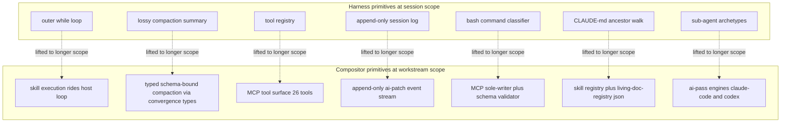

**Why this is non-trivial.** Each pair on the right is the answer to "what
would happen if you tried to run the harness primitive on the left across
sessions?" The harness's lossy compaction would lose structural commitments
across a stranger session — so the compositor uses *typed* compaction. The
session log would need to survive process death and replay months later — so
the compositor uses *append-only structured patches*. The bash classifier
gates destructive shell — so the compositor's MCP-as-sole-writer gates
destructive *doc mutation*.

The right column is not a list of things we built. It is the **shape every
multi-session harness will eventually grow into.** We just got there earlier.

---

## Diagram 2 — The MCP tool surface as the registry

The compositor MCP server exposes 26 tools (counted from
`scripts/living-doc-mcp-server.mjs`). They cluster cleanly into eight
sub-surfaces. This *is* the harness's tool registry, just typed for living-doc
work.

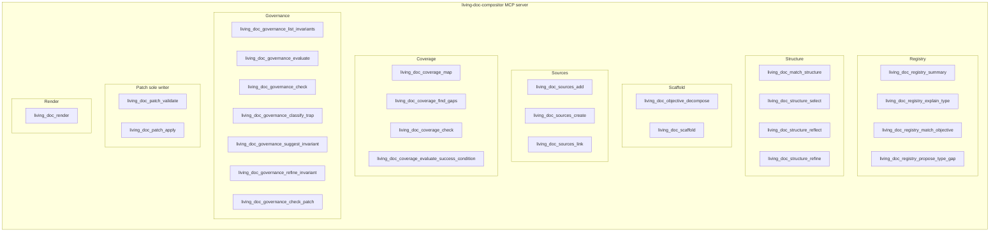

**Read across the surfaces.** Registry and Structure are *read-tier*
surfaces — they answer questions about the doc model. Scaffold, Sources,
Coverage, Governance are *workspace-tier* — they propose changes but do not
commit them. Patch is the *full-tier* surface — only `patch_apply` actually
writes the canonical. Render is read-after-write.

This is already a permission-tier model. It just isn't named one yet.

---

## Diagram 3 — The sole-writer sequence

Every mutation funnels through the same path. This is what makes replay possible.

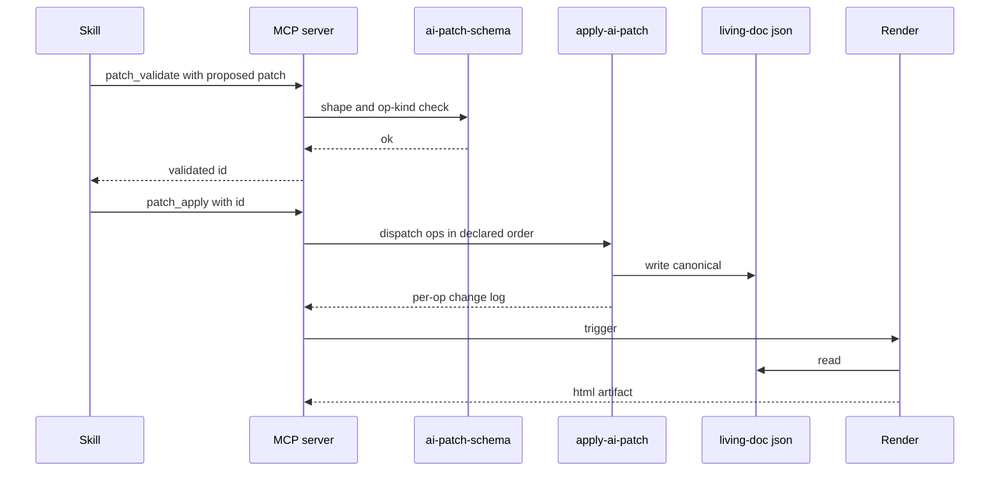

**The discipline this enforces.** A skill that writes JSON directly skips
validate and skips the change log. A render that gets hand-edited diverges
from JSON until the next render silently overwrites it. Both bypasses are
detectable by checking that the patch log replays to the current JSON. That
check should be a CI gate.

---

## Diagram 4 — AI-pass two-phase commit

`ai-pass-server.mjs` is already two-phase: propose generates and validates,
apply mutates. Human review fits in the gap. This is the harness's
"interactive approval before destructive ops" pattern, just with a UI.

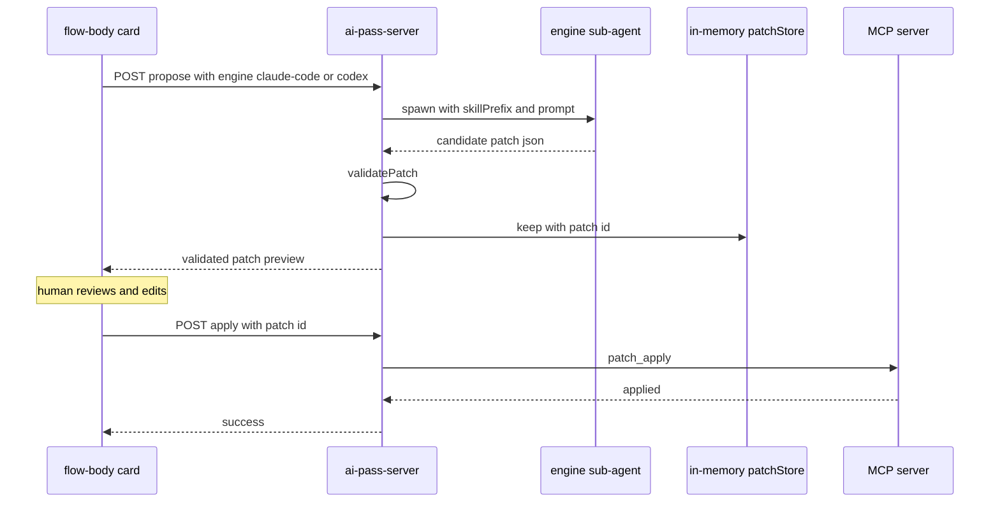

**Why this matters for the framing.** The harness gates destructive bash
*at run time*. The compositor gates destructive doc mutations *via two-phase
commit with a human in the loop*. Same insight: untrusted authority is
allowed to *propose*, only a privileged step *applies*. The privileged step
in the harness is approval; in the compositor it is `patch_apply` after
review.

---

## Diagram 5 — Sub-agent archetype dispatch

`claude-code` and `codex` are not just engine names. They are first-class
enums in `ai-patch-schema.json`, configured per user in
`~/.living-doc-compositor/ai-pass-config.json` with command and skillPrefix.
This is harness sub-agent archetyping.

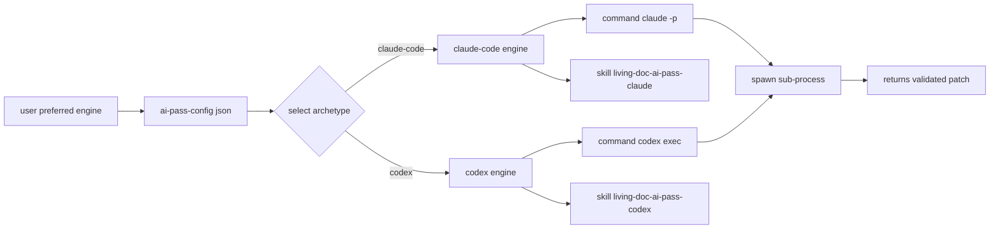

**The opportunity this names.** Today there are two archetypes both shaped
for "propose a patch." A third archetype slot is open for *verifier* — a
sub-agent that does not mutate but reads a proposed patch plus the current
doc and returns a verdict. That archetype is what would make the
patch-classifier model in Diagram 7 enforceable.

---

## Diagram 6 — The closed mutation vocabulary

Seven ops, seven targets. Adding an eighth without bumping schema is a
silent data loss. The closed vocabulary is what makes the patch log
replayable.

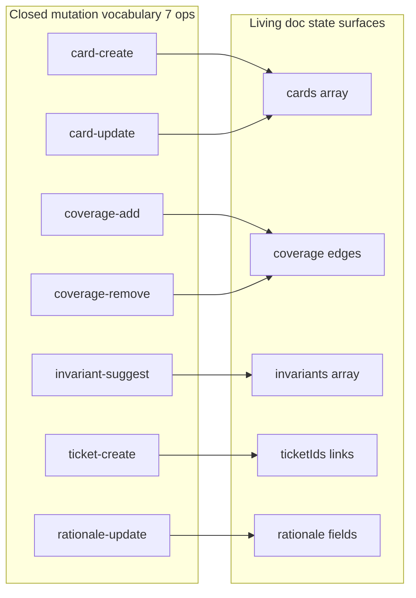

**Why closed-and-typed beats freeform.** A harness compaction prompt
produces a paragraph of text — lossy on purpose, sufficient for the rest of
one session. A living doc must replay across stranger sessions, so it
cannot afford freeform. The seven ops are the discipline that prevents
schema dissolution.

---

## Diagram 7 — Permission tiers, today and proposed

The harness already has a tier model on bash. The compositor has a sole-writer
discipline but no tier model on patch ops. The asymmetry is the gap.

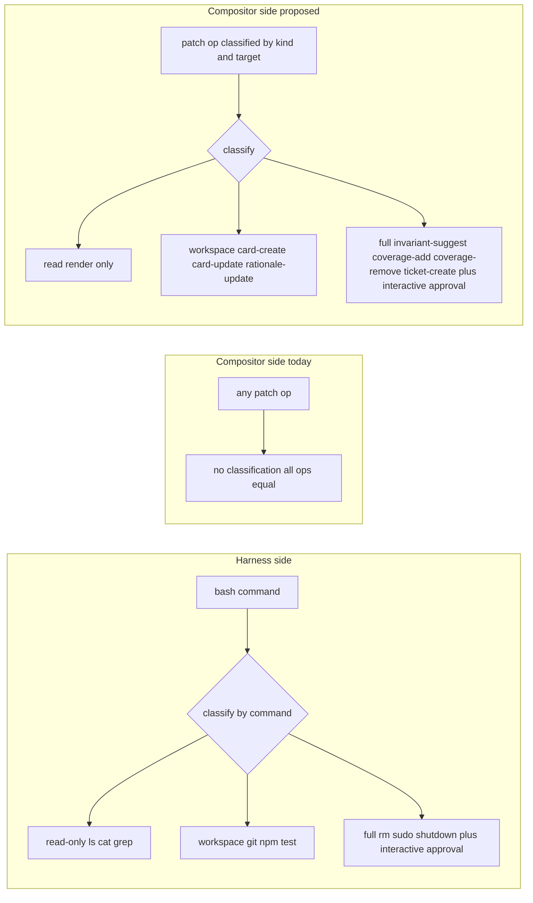

**Concrete consequence.** Right now an AI pass that wants to suggest a new
invariant is treated identically to one that wants to fix a typo in a
card's rationale. Tiering the ops means the high-impact ops (invariants,
coverage edges, ticket links) require human approval the way `rm -rf` does,
while typo fixes flow through.

---

## Diagram 8 — Compositor placement, current and three proposed

The hardest open architecture question: where exactly does the compositor
live relative to the harness?

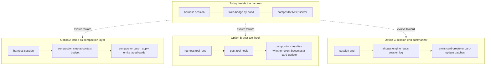

**My read.** Option C is the cheapest and most additive: nothing changes
inside a session, but every session-end can optionally run an ai-pass that
folds the session into a card. Option A is the most ambitious: the
harness's own compaction *is* a compositor patch_apply, which means a
running session is continuously projecting into a living doc. Option B is
in between and probably the wrong shape — too fine-grained, too noisy.

This is the one diagram I most want feedback on, since it is the only one
that is genuinely *open*.

---

## Diagram 9 — Four real failure modes

Replacing the generic "prefix-cache trap" with the cascades that actually
threaten this codebase.

**The defense each one needs.**
- *Patch-op drift* — schema version pinned in every patch; CI rejects
  patches whose schema version exceeds the deployed validator.
- *Render-drift* — HTML files have a header pragma `JSON canonical render do
  not edit`; pre-commit hook refuses HTML changes without a JSON change.
- *Skill-as-shell-script* — every SKILL.md declares which MCP tools it
  uses; CI scans skills for raw `gh issue create`, `cat > docs/`, etc., and
  flags.
- *Compaction-fidelity collapse* — `card-update` is restricted to
  field-level updates by default; full-body replace requires a
  `--replace-body` flag and is logged distinctly.

---

## Diagram 10 — Skill taxonomy under the new framing

If a skill cannot be slotted into one of these three classes, it is
probably misshapen.

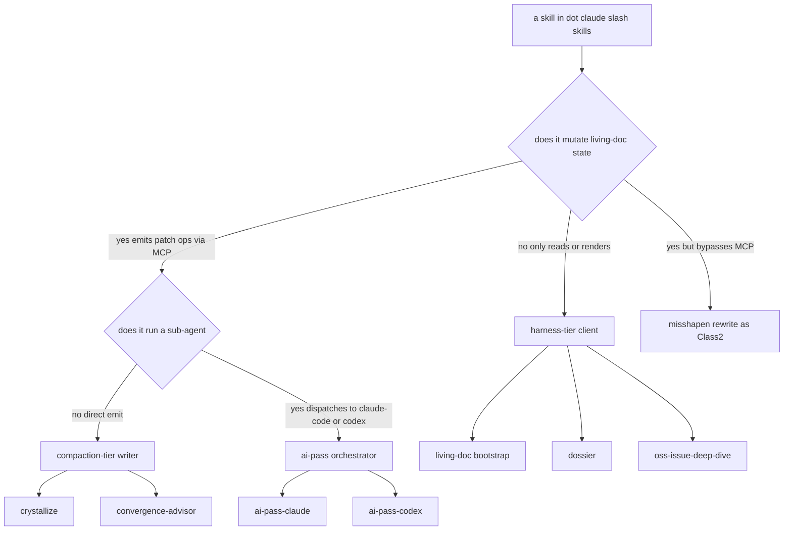

**The asymmetry the diagram exposes.** Today most skills are Class 1 (read
and present) or Class 3 (run an ai-pass). Class 2 — direct typed-patch
emission — is small. That asymmetry is suspicious. If `crystallize` and
`convergence-advisor` are doing patch-op work, are they doing it through
MCP, or do they have direct write paths that should be revoked?

---

## Diagram 11 — The compaction question

The one decision the framing forces us to answer. What runs at the boundary
between a session and a living doc?

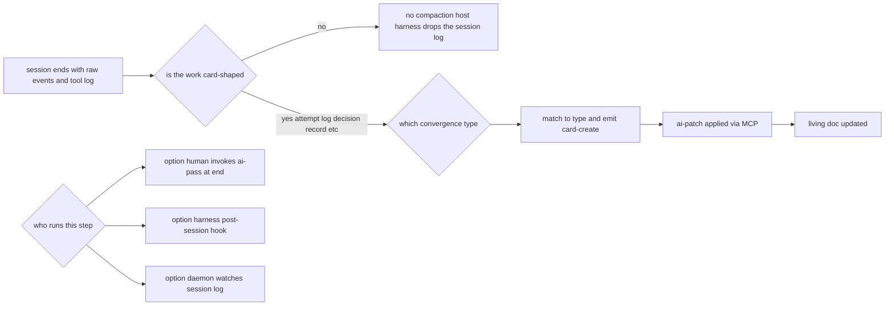

**This is the question Diagram 8 is actually about.** Picking an option in
Diagram 8 is picking a "who runs this step" answer in Diagram 11.

---

## Diagram 12 — What the framing buys us as one picture

The last diagram. The reframe is the whole product.

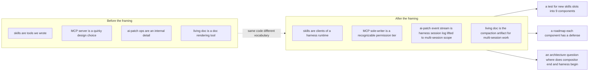

---

## What changes in the HTML page versus the diagrams

The HTML page should *embed* these diagrams (Mermaid renders client-side or
pre-rendered SVG). Surrounding prose should be tight — each diagram carries
its own argument; prose is the connective tissue, not the body. Estimated
final shape: ~12 diagrams, ~600 words of prose, single page.

---

## Open questions for review

1. **Diagram 8 specifically** — am I right that Option C is the right
   first move? Or is Option A the actual ambition and Option C is
   procrastination?
2. **Diagram 7's proposed tiering** — is invariant-suggest really *full*
   tier, or is it workspace-tier with a separate "must be reviewed"
   flag? The two are not the same.
3. **Diagram 10's misshapen-skill check** — should this be a CI gate, or
   just authoring guidance?
4. **Diagrams to cut** — 12 is a lot. If you had to drop three, which?
   My instinct: 5 (sub-agent dispatch — covered enough by 4),
   maybe 12 (the meta-summary is what the lede paragraph already says).
